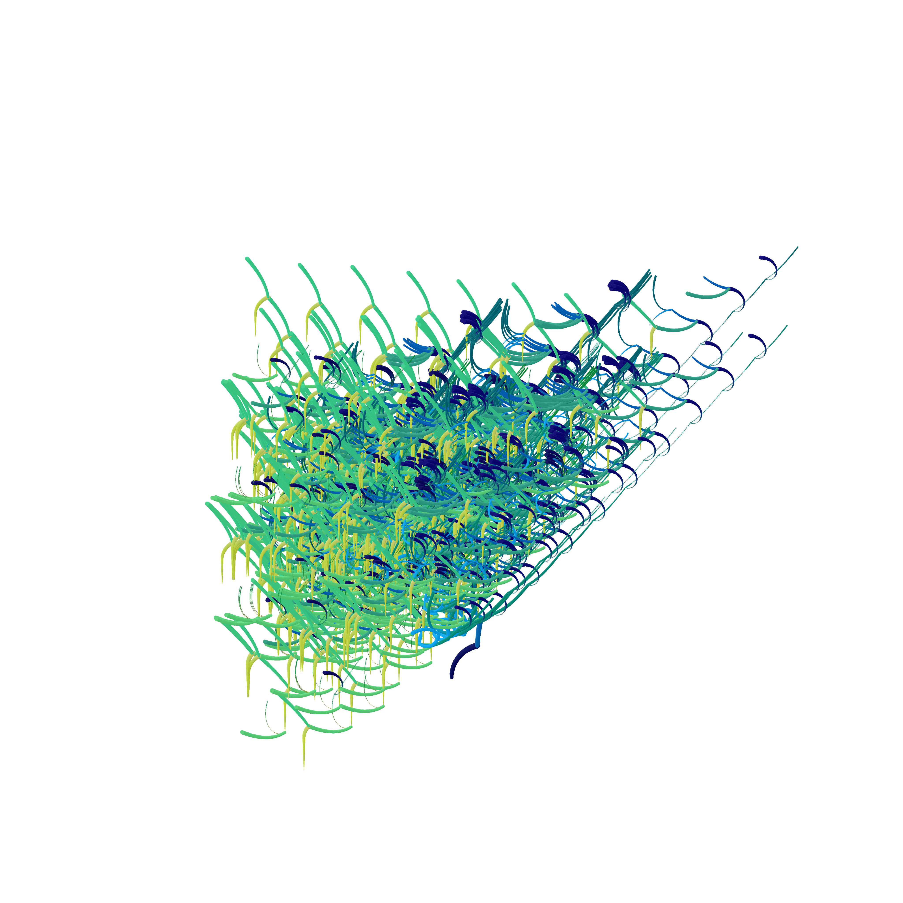
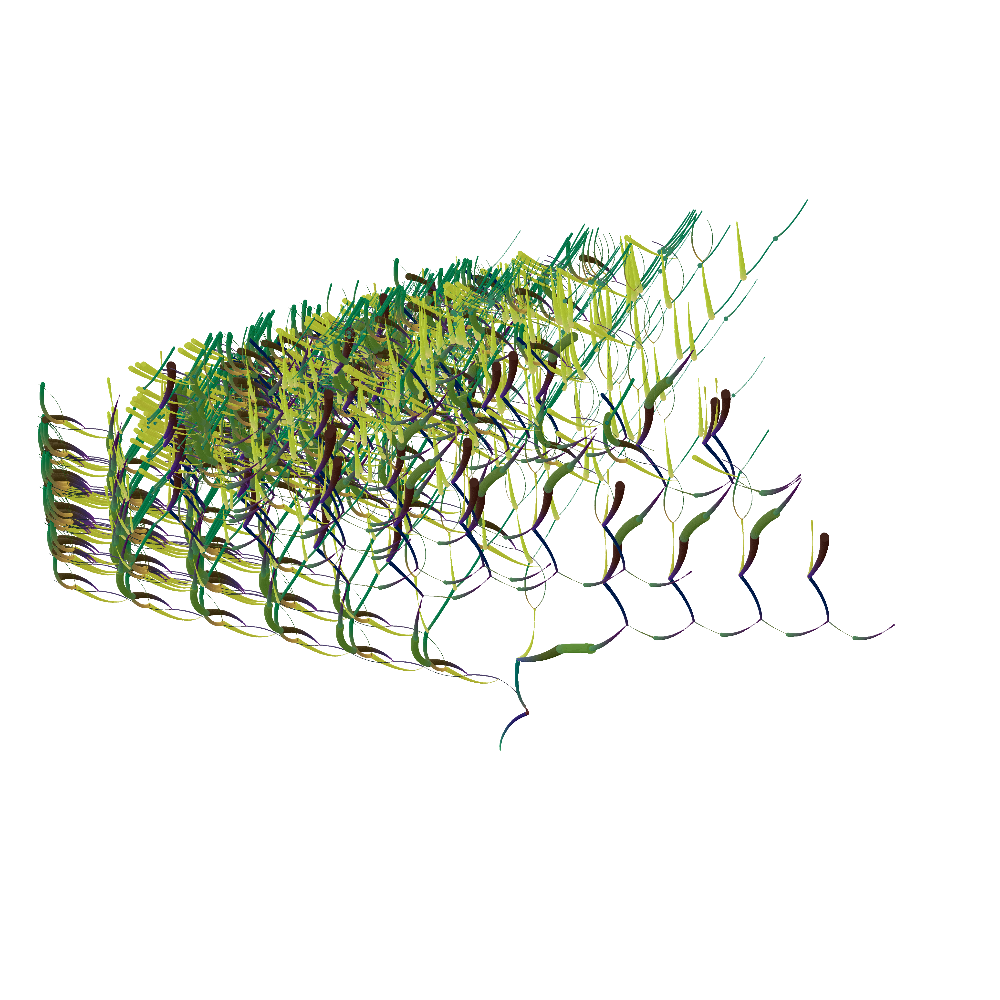
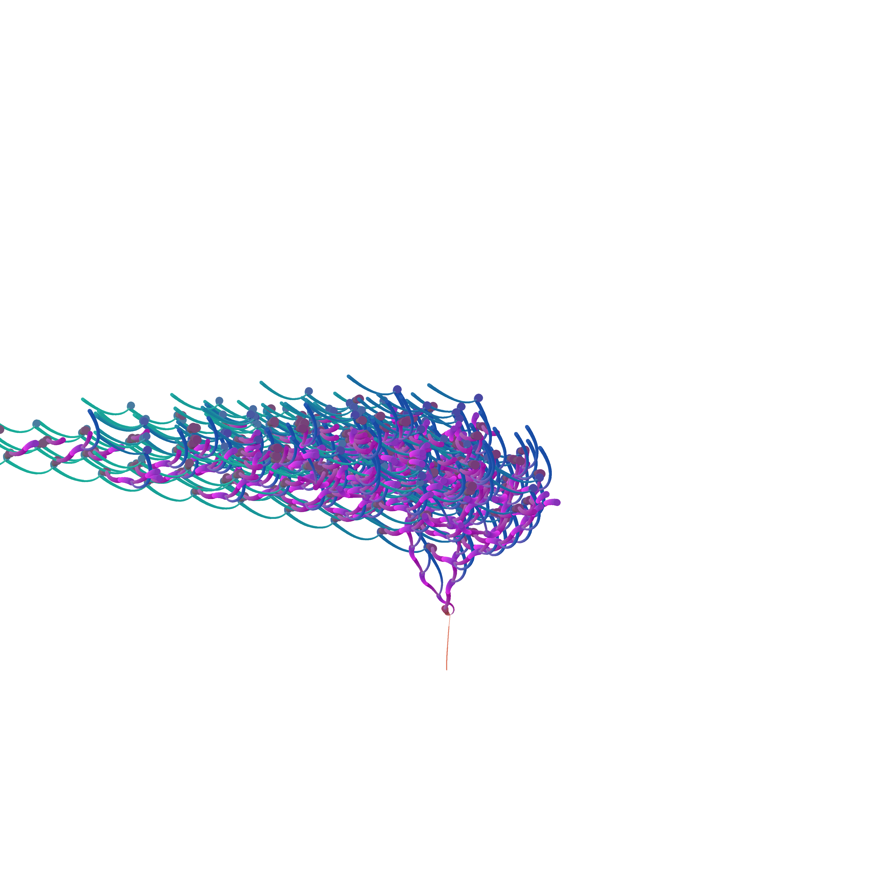
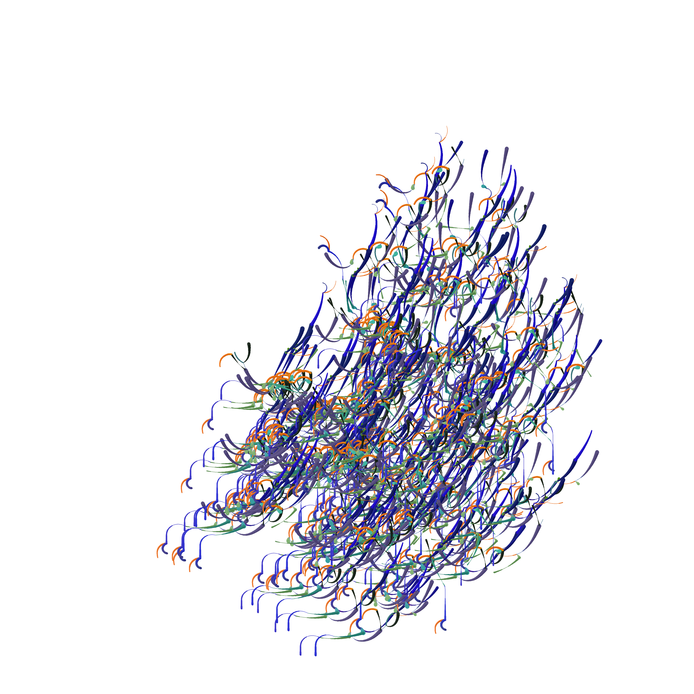
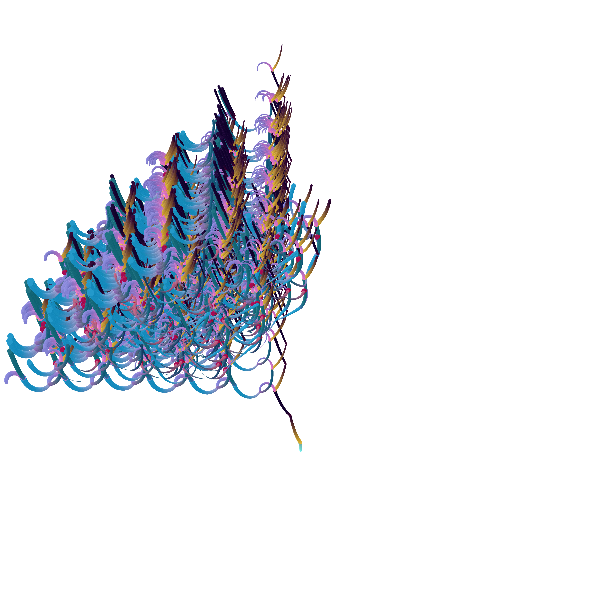
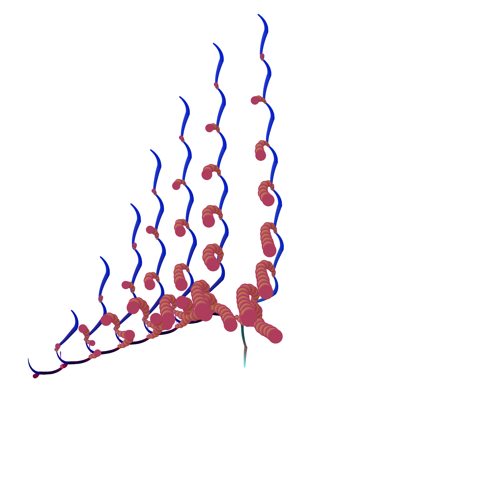

# PlantyPlant
Genetic algorithm-based image generator without neural networks

The plant genome is a byte table with a fixed number of columns but a variable number of rows. Each agent sequentially draws colored circles, which eventually form trunks, leaves, vines, and so on. Each row of the table (also known as a chromosome) describes the agent's work and which agents it will spawn upon completion. PlantyPlant was not published until version 3.2, so earlier versions are unavailable. 3.2 is also considered an unfinished demo version.

